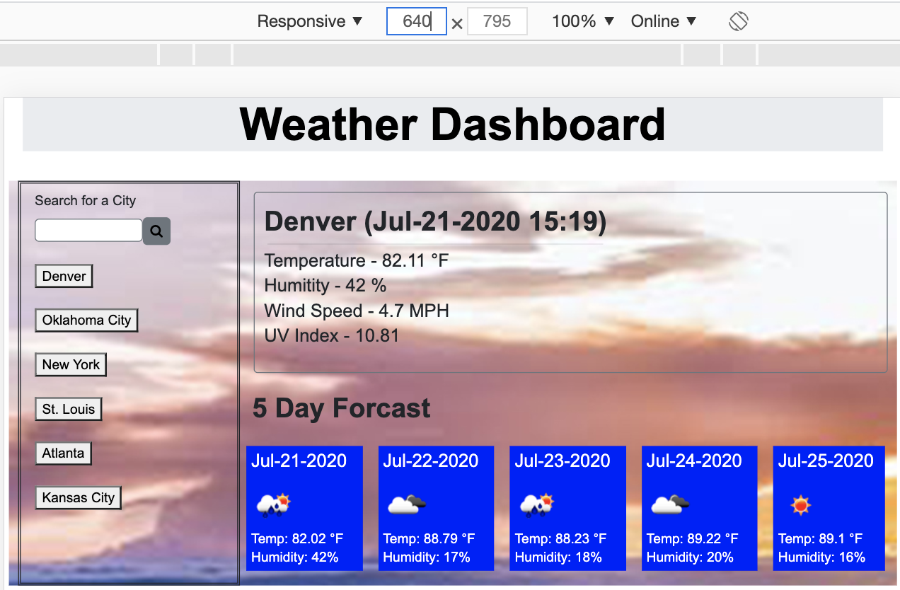
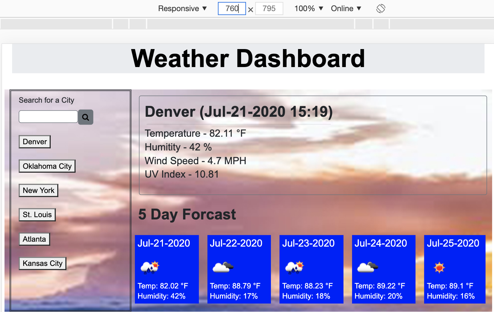
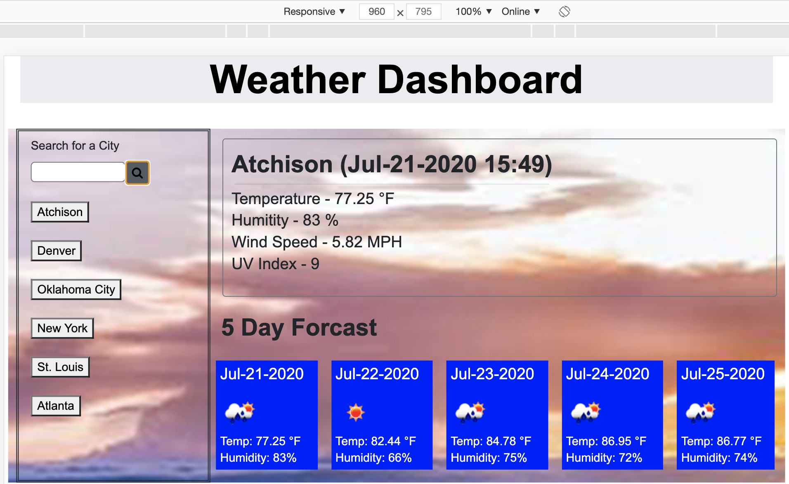
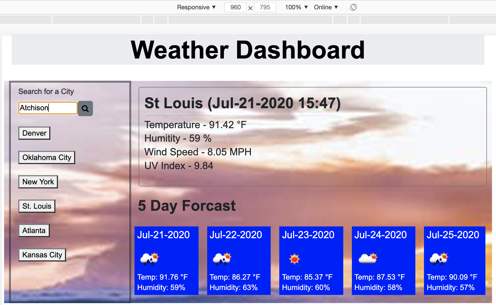
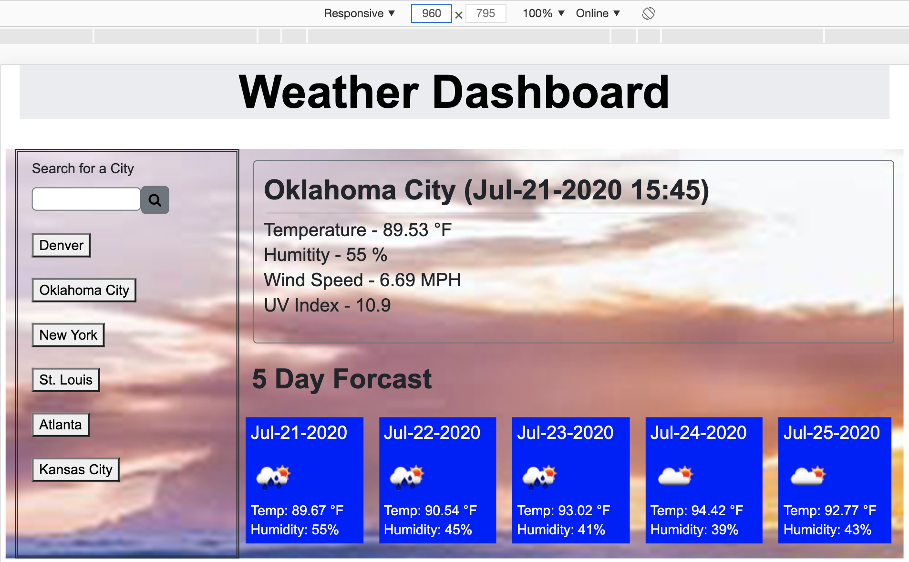
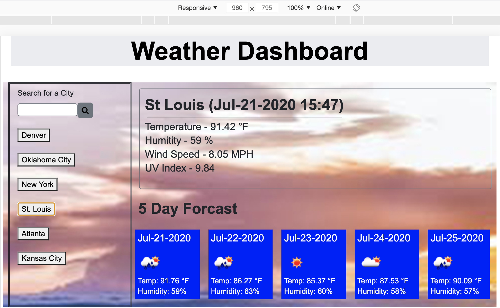
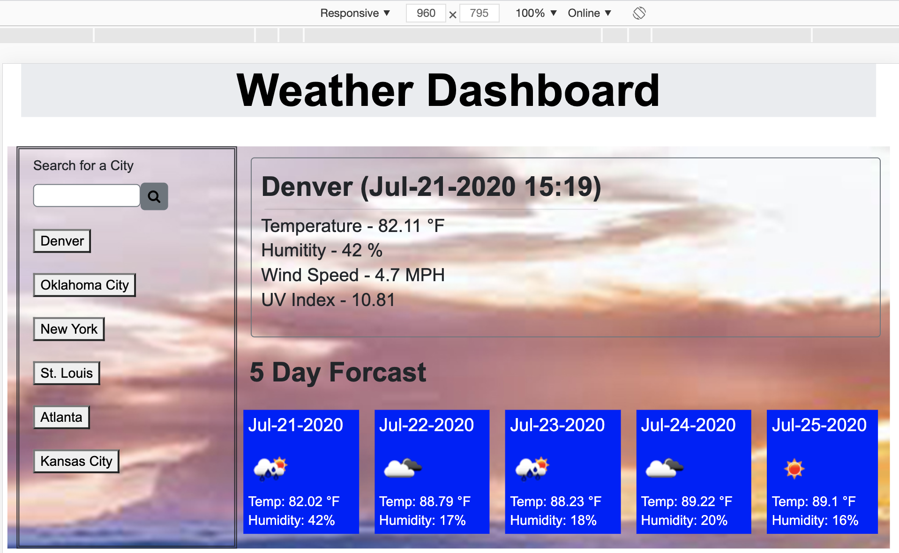

# weatherapp
HW#6 Weather app

This is our 6th homework.

This is the git URL for the project - https://github.com/cermqm/weatherapp.

This is the website URL for the project - https://cermqm.github.io/weatherapp/

It felt harder than the last assignment mainly because I didn't have as much time to work on it.

Functionality requested was to have a city search and store the most recient cities for future use.

At the top of the right of the page is the current forcast, city name and date - then some data points - temp, humidity, wind speed and UV index.

At the bottom of the right side of the page is the 5 day forcast with the date, icon for weather that day and temp and humidity.

Below are the screen shots of the app in action

